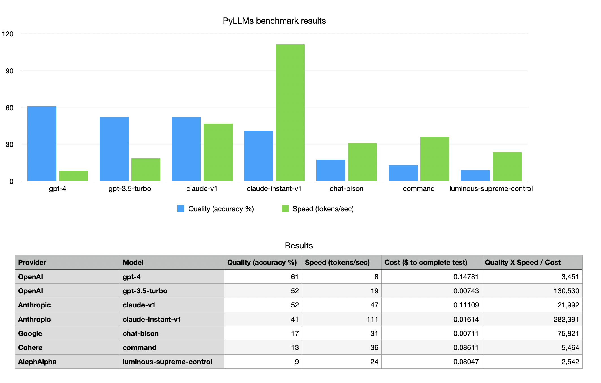

# PyLLMs

[](https://discord.gg/aDNg6E9szy) [](https://twitter.com/KagiHQ) [](https://opensource.org/license/mit/) 

PyLLMs is a minimal Python library to connect to LLMs (OpenAI, Anthropic, Google, AI21, Cohere, Aleph Alpha, HuggingfaceHub) with a built-in model performance benchmark. 

It is ideal for fast prototyping and evaluating different models thanks to:
- Connect to top LLMs in a few lines of code
- Response meta includes tokens processed, cost and latency standardized across the models
- Multi-model support: Get completions from different models at the same time
- LLM benchmark: Evaluate models on quality, speed and cost

Feel free to reuse and expand. Pull requests are welcome.

# Installation

Install the package using pip:

```
pip install pyllms
```


# Usage


```
import llms

model = llms.init('gpt-4')
result = model.complete("what is 5+5")

print(result.text)  

```

Library will attempt to read the API keys and the default model from environment variables, which you can set like this (for the provider you are using):

```
export OPENAI_API_KEY="your_api_key_here"
export ANTHROPIC_API_KEY="your_api_key_here"
export AI21_API_KEY="your_api_key_here"
export COHERE_API_KEY="your_api_key_here"
export ALEPHALPHA_API_KEY="your_api_key_here"
export HUGGINFACEHUB_API_KEY="your_api_key_here"
export GOOGLE_API_KEY="your_api_key_here"

export LLMS_DEFAULT_MODEL="gpt-3.5-turbo"
```


Alternatively, you can pass initialization values to the init() method:

```
model=llms.init(openai_api_key='your_api_key_here', model='gpt-4')
```

For using Google LLMs through Vertex AI API, see "Using Google AI models" below.

You can also pass optional parameters to the complete method. 'temperature' and 'max_tokens' are standardized across all APIs and get converted to the corresponding API params. 

Any other parameters accepted by the original model are supported in their verbatim form.

```
result = model.complete(
    "what is the capital of country where mozzart was born",
    temperature=0.1,
    max_tokens=200
)
```

Note: By default, temperature for all models is set to 0, and max_tokens to 300.

The result meta will contain helpful information like tokens used, cost (which is automatically calculated using current pricing), and response latency:
```
>>> print(result.meta)
{
  'model': 'gpt-3.5-turbo', 
  'tokens': 34, 
  'tokens_prompt': 20, 
  'tokens_completion': 14, 
  'cost': '0.00007', 
  'latency': 1.4
}
```


## Multi-model usage

You can also initialize multiple models at once! This is very useful for testing and comparing output of different models in parallel. 

```
>>> models=llms.init(model=['gpt-3.5-turbo','claude-instant-v1'])
>>> result=models.complete('what is the capital of country where mozzart was born')
>>> print(result.text)
[
 'The capital of the country where Mozart was born is Vienna, Austria.', 
 'Wolfgang Amadeus Mozart was born in Salzburg, Austria.\n\nSo the capital of the country where Mozart was born is Vienna, Austria.'
]

>>> print(result.meta)
[
 {'model': 'gpt-3.5-turbo', 'tokens': 34, 'tokens_prompt': 20, 'tokens_completion': 14, 'cost': 6.8e-05, 'latency': 0.7097790241241455}, 
 {'model': 'claude-instant-v1', 'tokens': 54, 'tokens_prompt': 20, 'tokens_completion': 34, 'cost': 5.79e-05, 'latency': 0.7291600704193115}
]
```

## Async support
Async completion is supported for compatible models. It is not supported in multi-models mode yet.
```
result = await model.acomplete("what is the capital of country where mozzart was born")
```

## Streaming support

PyLLMs supports streaming from compatible models. 'complete_stream' method will return generator object and all you have to do is iterate through it:

```
model= llms.init('claude-v1')
result = model.complete_stream("write an essay on civil war")
for chunk in result:
   if chunk is not None:
      print(chunk, end='')   
```

Current limitations:
- When streaming, 'meta' is not available
- Multi-models are not supported for streaming


Tip: if you are testing this in python3 CLI, run it with -u parameter to disable buffering:

```
python3 -u
```

## Chat history and system message

You can pass the history of conversation in a list using the following format:

```
history=[]
history.append({"role": "user", "content": user_input})
history.append({"role": "assistant", "content": result.text})  

model.complete(prompt=prompt, history=history)

```

In addition, OpenAI chat models support system message:

```
model.complete(prompt=prompt, system_message=system, history=history)

```

## Other methods

You can count tokens using the model's tokenizer:

```
count=model.count_tokens('the quick brown fox jumped over the lazy dog')
```

## Using OpenAI API on Azure (and elsewhere, where compatible)

PyLLMs supports optional params to specify base path for the OpenAI input/output format, for example OpenAI models running on Azure.

```
import llms
AZURE_API_BASE = "{insert here}"
AZURE_API_KEY = "{insert here}"

model = llms.init('gpt-4')

azure_args = {
    "engine": "gpt-4",  # Azure deployment_id
    "api_base": AZURE_API_BASE,
    "api_type": "azure",
    "api_version": "2023-05-15",
    "api_key": AZURE_API_KEY,
}

openai_result = model.complete("what is 5+5")
azure_result = model.complete("what is 5+5", **azure_args)

model.benchmark(**azure_args)
```

# Model Benchmarks

Models are appearing like mushrooms after rain and everyone is interested in three things:

1) Quality
2) Speed
3) Cost

PyLLMs icludes an automated benchmark system. The quality of models is evaluated using a powerful model (for example gpt-4) on a range of predefined questions, or you can supply your own.


```
models=llms.init(model=['gpt-3.5-turbo', 'claude-instant-v1'])

gpt4=llms.init('gpt-4') # optional, evaluator can be ommited and in that case only speed and cost will be evaluated

models.benchmark(evaluator=gpt4)
```



```
+-------------------------+--------------------+---------------------+----------------------+-------------------------+------------------+
|          Model          |       Tokens       |       Cost ($)      |     Latency (s)      |    Speed (tokens/sec)   |    Evaluation    |
+-------------------------+--------------------+---------------------+----------------------+-------------------------+------------------+
| GoogleProvider('chat-bison') | Total Tokens: 2759 | Total Cost: 0.00689 | Median Latency: 2.83 | Aggregated speed: 36.24 | Accuracy: 19.23% |
| GoogleProvider('text-bison') | Total Tokens: 1155 | Total Cost: 0.00897 | Median Latency: 0.38 | Aggregated speed: 60.60 | Accuracy: 25.64% |
| CohereProvider('command') | Total Tokens: 4033 | Total Cost: 0.08125 | Median Latency: 5.77 | Aggregated speed: 9.44 | Accuracy: 11.54% |
| OpenAIProvider('gpt-3.5-turbo') | Total Tokens: 2570 | Total Cost: 0.00825 | Median Latency: 2.38 | Aggregated speed: 30.47 | Accuracy: 38.46% |
| OpenAIProvider('gpt-4') | Total Tokens: 2860 | Total Cost: 0.21837 | Median Latency: 3.22 | Aggregated speed: 10.52 | Accuracy: 44.87% |
| AnthropicProvider('claude-instant-v1') | Total Tokens: 3437 | Total Cost: 0.02153 | Median Latency: 1.84 | Aggregated speed: 61.64 | Accuracy: 42.31% |
| AnthropicProvider('claude-2') | Total Tokens: 3545 | Total Cost: 0.13337 | Median Latency: 6.83 | Aggregated speed: 19.51 | Accuracy: 69.23% |
+-------------------------------+--------------------+---------------------+----------------------+-------------------------+------------------+

```

To evaluate models on your own prompts, simply pass a list of questions and optional answers as tuple. The evaluator will automatically evaluate the responses:

```
models.benchmark(prompts=[("what is the capital of finland", "helsinki")], evaluator=gpt4)
```

# Supported Models

To get a list of supported models, call list(). Models will be shown in the order of least expensive to most expensive.

```
>>> model=llms.init()

>>> model.list()

>>> model.list("gpt') # lists only models with 'gpt' in name/provider name
```

Here is a pretty table of supported models (in alphabetical order).
```

| Provider            | Name                   | Prompt Cost | Completion Cost | Token Limit |
|---------------------|------------------------|-------------|-----------------|-------------|
| AI21Provider        | j2-grande-instruct     |        10.0 |            10.0 |        8192 |
| AI21Provider        | j2-jumbo-instruct      |        15.0 |            15.0 |        8192 |
| AlephAlphaProvider  | luminous-base          |         6.6 |             7.6 |        2048 |
| AlephAlphaProvider  | luminous-extended      |         9.9 |            10.9 |        2048 |
| AlephAlphaProvider  | luminous-supreme       |        38.5 |            42.5 |        2048 |
| AlephAlphaProvider  | luminous-supreme-control |      48.5 |            53.6 |        2048 |
| AnthropicProvider   | claude-instant-v1      |        1.63 |            5.51 |        9000 |
| AnthropicProvider   | claude-v1              |       11.02 |           32.68 |        9000 |
| CohereProvider      | command                |        25.0 |            25.0 |        8192 |
| CohereProvider      | command-nightly        |        25.0 |            25.0 |        8192 |
| GoogleProvider      | chat-bison             |         0.5 |             0.5 |        2048 |
| HuggingfaceHub      | hf_pythia              |         0.0 |             0.0 |        2048 |
| OpenAIProvider      | gpt-3.5-turbo          |         2.0 |             2.0 |        4000 |
| OpenAIProvider      | gpt-4                  |        30.0 |            60.0 |        8000 |

```

Useful links:\
[OpenAI documentation](https://platform.openai.com/docs/api-reference/completions)\
[Anthropic documentation](https://console.anthropic.com/docs/api/reference#-v1-complete)\
[AI21 documentation](https://docs.ai21.com/reference/j2-instruct-ref)\
[Cohere documentation](https://cohere-sdk.readthedocs.io/en/latest/cohere.html#api)\
[Aleph Alpha documentation](https://aleph-alpha-client.readthedocs.io/en/latest/aleph_alpha_client.html#aleph_alpha_client.CompletionRequest)\
[Google Generateive AI
documentation](https://developers.generativeai.google/guide)
[Google Vertex AI documentation](https://cloud.google.com/vertex-ai/docs/generative-ai/chat/test-chat-prompts)


## Using Google Vertex LLM models

0. (Set up a GCP account and create a project)
1. Enable Vertex AI APIs in your GCP project - https://console.cloud.google.com/flows/enableapi?apiid=aiplatform.googleapis.com
1. Install gcloud CLI tool - https://cloud.google.com/sdk/docs/install
2. Set up Application Default Credentials - https://cloud.google.com/docs/authentication/provide-credentials-adc#how-to
3. Now you should be able to init Google LLM 

```
model = llms.init('chat-bison')
result = model.complete("hello!")
```

# License

This project is licensed under the MIT License.

